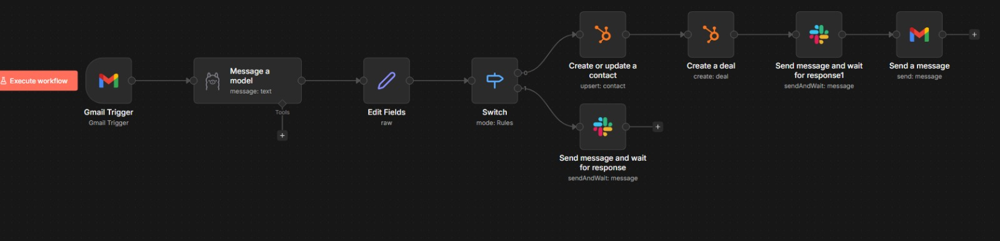
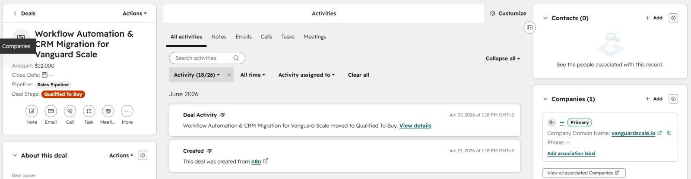

# Project 1: The Executive "Deep Work" Inbox Triage & CRM Engine

## Objective
Protect executive focus by establishing an autonomous ingestion and filtration layer for inbound communications. The system handles background database syncs, drops junk interactions, and prepares structured response drafts for high-value interactions.

## Flow Architecture


```
[Gmail Trigger] ➔ [Ollama / Local LLM (JSON Schema)] ➔ [Switch Router]
                                                           ├──> Lead ➔ [HubSpot API] ➔ [Slack Block Kit Draft Button]
                                                           └──> Urgent ➔ [Slack Pager/SMS Alert]
```
### n8n


### HubSpot


### Slack


### Gmail


## Functional Breakdown
* **Zero-Shot Classification:** Inbound emails are passed to an LLM context window to extract transactional intent and categorize items dynamically (`New Lead`, `Current Client Urgent`, `Spam`, or `Partnership`).
* **CRM Synchronization:** When a `New Lead` profile is parsed, contact data fields are isolated, checked for duplicates, and automatically written into the HubSpot CRM deal tracking workspace.
* **Asynchronous Human-in-the-Loop:** Instead of sending direct, unreviewed AI messages to prospects, the system posts an interactive block-kit message to Slack. Approving the notification prompts n8n to call the Gmail API and stage a draft response embedded with custom calendar scheduler hooks.

## Configuration Details
The exported engine profile resides in `/workflows/crm_triage_engine.json`. 

### Required Variables
* `HUBSPOT_API_KEY`
* `OPENAI_API_KEY` / `ANTHROPIC_API_KEY`
* `GMAIL_OAUTH2_TOKEN`
* `SLACK_WEBHOOK_URL`