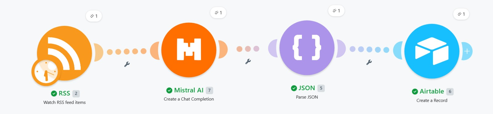
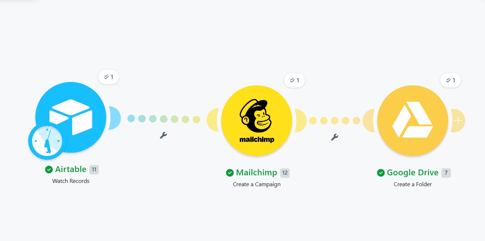
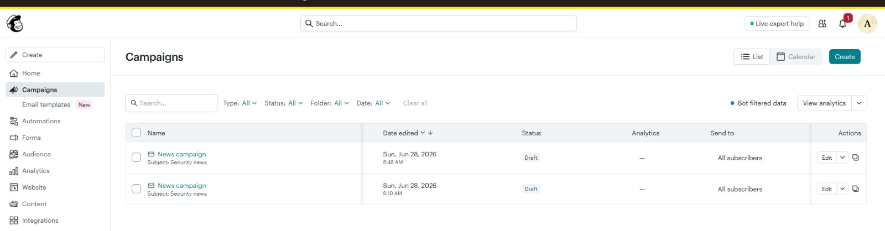
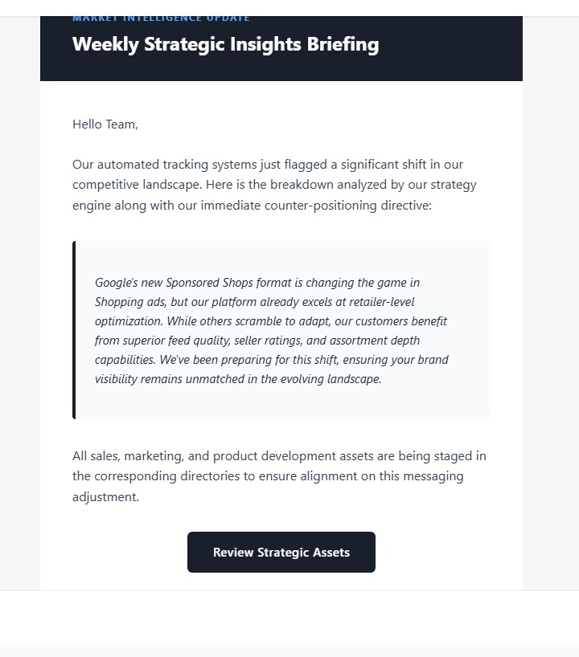

# Project 3: Automated Competitor Intelligence & Marketing Pipeline

## Objective
Automate competitive monitoring, run heuristic threat assessments on outbound industry market data shifts, and automatically stage draft communication collateral and media asset directories for marketing teams.

## Flow Architecture

```
[Scheduled Polling / Scraper] ➔ [Airtable Hub] ➔ [Filter: Status Change] ➔ [AI Asset Generator]
                                                                            └──> [Mailchimp Content Pipeline]
```

### Airtable




### Mailchimp



### Gmail



### Google Drive 


## Functional Breakdown
* **Autonomous Market Scraping:** The system relies on a Cron intervals monitor or RSS change listeners to parse new promotional text configurations, pricing shifts, or announcement blog drops from competitor domains.
* **Strategic Heuristics Analysis:** Text strings are evaluated by an LLM strategy node to explicitly extract: core competitive angles, target audience focus changes, calculated threat severity ratings, and actionable marketing response notes.
* **Staged Content Distribution:** High-value alerts write data blocks straight to a master research table inside Airtable. Simultaneously, the copy layer is structured, pushed into Mailchimp as a staged newsletter campaign component, and hooks into Google Drive to build asset directory paths for creative design workflows.

## Configuration Details
Import the Make structural blueprint file `/blueprints/The Marketing Asset & Newsletter Stager.blueprint.json` directly into
Import the Make structural blueprint file `/blueprints/Competitor Intelligence Ingestion.blueprint.json` directly into